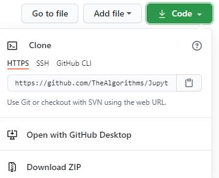

# Contributing

When contributing to this repository, please first discuss the change you wish to make via issue,
email, or any other method with the owners of this repository before making a change.

Please note we have a code of conduct, please follow it in all your interactions with the project.

If you don't have git on your machine, [install it](https://help.github.com/articles/set-up-git/).

## The beginner's guide to contributing to a GitHub project


## Fork this repository

Fork this repository by clicking on the fork button on the top of this page.
This will create a copy of this repository in your account.

## Clone the repository


Now clone the forked repository to your machine. Go to your GitHub account, open the forked repository, click on the code button and then click the _copy to clipboard_ icon.

Open a terminal and run the following git command:

```
git clone "url you just copied"
```

where "url you just copied" (without the quotation marks) is the url to this repository (your fork of this project). See the previous steps to obtain the url.



For example:

```
git clone https://github.com/TheAlgorithms/Jupyter
```

where `this-is-you` is your GitHub username. Here you're copying the contents of the first-contributions repository on GitHub to your computer.

## Create a branch

Change to the repository directory on your computer (if you are not already there):

```
cd Jupyter
```

Now create a branch using the `git checkout` command:

```
git checkout -b <add-your-new-branch-name>
```

For example:

```
git checkout -b add-alonzo-church
```

(The name of the branch does not need to have the word _add_ in it, but it's a reasonable thing to include because the purpose of this branch is to add your name to a list.)

## Make necessary changes and commit those changes

Now open `Contributors.md` file in a text editor, add your name to it. Don't add it at the beginning or end of the file. Put it anywhere in between. Now, save the file.


If you go to the project directory and execute the command `git status`, you'll see there are changes.

Add those changes to the branch you just created using the `git add` command:

```
git add Contributors.md
```

Now commit those changes using the `git commit` command:

```
git commit -m "Add <your-name> to Contributors list"
```

replacing `<your-name>` with your name.

## Push changes to GitHub

Push your changes using the command `git push`:

```
git push origin <add-your-branch-name>
```

replacing `<add-your-branch-name>` with the name of the branch you created earlier.

## Submit your changes for review

If you go to your repository on GitHub, you'll see a `Compare & pull request` button. Click on that button.


Now submit the pull request.


Soon I'll be merging all your changes into the master branch of this project. You will get a notification email once the changes have been merged.

## Contributing new algorithms

- Make your pull requests to be **specific** and **focused**. Instead of contributing "several algorithms" all at once contribute them all one by one separately (i.e. one pull request for "Logistic Regression", another one for "K-Means" and so on).

- Every new algorithm must have:
  - **Source code** with comments and readable namings
  - **Math** being explained in README.md along with the code
  - **Jupyter demo notebook** with example of how this new algorithm may be applied

If you're adding new **datasets** they need to be saved in the `/data` folder. CSV files are preferable. The size of the file should not be greater than `30Mb`.

## Where to go from here?

Congrats! You just completed the standard _fork -> clone -> edit -> PR_ workflow that you'll encounter often as a contributor!

## Reference

- [https://github.com/firstcontributions](https://github.com/firstcontributions)
